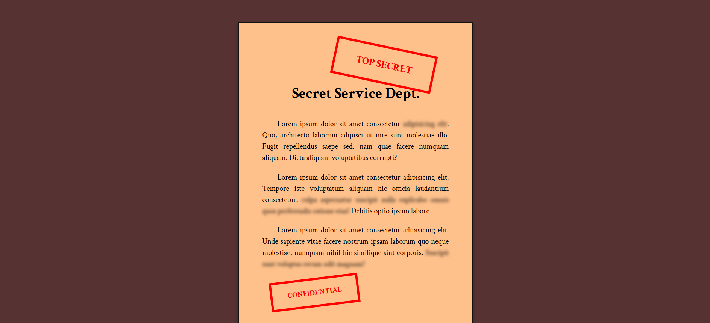

# 📁 Confidential Email Page

## ℹ️ A simple confidential email web page

This project simulates a confidential email message layout, styled to resemble a classified document. It was built entirely with HTML and CSS as part of the [**freeCodeCamp.org**](https://www.freecodecamp.org/learn/full-stack-developer/) CSS course.

---

## 🔍 Overview

The Confidential Email Page is a creatively styled HTML-CSS mockup of a sensitive government document. It features warning labels, a fixed-width main layout, and sections of blurred text to imply redacted or hidden content.

The goal of this project was to practice creative use of CSS properties like `filter`, `transform`, and custom variables, while strengthening understanding of layout and visual hierarchy. It’s a fun and thematic challenge focused on presentation.

---

## ✨ Features

- 📄 Faux confidential document design using HTML and CSS only
- 🕶️ Blurred redacted text using CSS `filter: blur()`
- 🟥 "TOP SECRET" and "CONFIDENTIAL" stamps using styled `
`s
- 📐 Centered layout with consistent spacing
- 🎯 Fully responsive on various screen sizes
- 💡 Thematic color scheme and typography to simulate official tone

---

## 🧠 What I Learned

- How to apply **CSS `filter: blur()`** for visual effects
- The power of **pseudo-professional design using simple elements**
- How to use **CSS variables** to manage colors, spacing, and styling efficiently
- The use of **custom layout sizes** for print-style documents
- Combining **text effects and box shadows** for realistic design appeal

---

## 🛠️ Tech Used

- HTML5
- CSS3

---

## 🚀 How to Run

1. Clone the repository
2. Navigate to this project folder
3. Open `index.html` in your browser

---

## 🌐 Live Demo

Or you can check out the 👉 [live website here](https://html-css-daily.netlify.app/build%20a%20confidential%20email%20page/)

---

## 🧑‍💻 Author

Created by **Elmar Chavez**

🗓️ Month/Year: **May 2025**

📚 Journey: **2nd** month of learning _frontend web development_.
